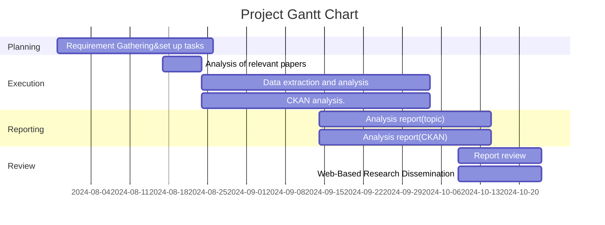

# Project Roadmap: Accelerating 

## 1. Cover Page
- **Project Name**: Accelerating
- **Document Title**: Project Roadmap
- **Version**: 1.0
- **Date**: August 21, 2024
- **Prepared by**: Doeun Han, Project Manager

## 2. Table of Contents
3. [Project Introduction](#3-project-introduction)
4. [Project Timeline](#4-project-timeline)
    - [Milestones](#41-milestones)
    - [Gantt Chart](#42-gantt-chart)
5. [Resource Planning](#5-resource-planning)
    - [Personnel Allocation](#51-personnel-allocation)
    - [Budget Plan](#52-budget-plan)
6. [Risk Management](#6-risk-management)
    - [Risk List](#61-risk-list)
7. [Decision Log](#7-decision-log)
8. [Progress Reports](#8-progress-reports)
9. [Change Management](#9-change-management)
10. [Communication Plan](#10-communication-plan)
11. [Appendices](#11-appendices)

## 3. Project Introduction
- **Project Goal**:  CKAN is building a diverse ecosystem under the banner of open data and government transparency. This project is not limited to developing new software or commercial tools. Its goal is to expand the ecosystem surrounding open data and explore the advancement of civic tech. Therefore, the project's ultimate purpose is to identify and address obstacles or limitations that hinder this progress. The project does not have a specific product development direction; instead, participants will explore the ecosystem, experience it as members, and discover new value.
- **Project Overview**: The client aims to expand the CKAN ecosystem and increase the number of users, including government agencies in the Canberra region, who utilize CKAN. A significant challenge is that people are not fully aware of CKAN's usability. Therefore, this project focuses on highlighting CKAN's usability by providing a strong use case. The goal is to create a data analysis report using CKAN, which will serve as a definitive use case for the CKAN community. Simultaneously, the project aims to enhance CKAN's strengths through usability analysis. This will be a year-long project, with the first semester focused on developing the use case and analyzing CKAN's strengths and weaknesses. The second semester will then focus on enhancing CKAN's functionality based on the insights gained from the first semester's analysis.
- **Scope**: The project includes software development, testing, deployment, and initial support phases, as well as report analysis and visualization, and analysis of the software’s strengths and weaknesses.
- **Project phases**: The exploration of solutions will be divided into two phases over two semesters. In the first semester, students will engage as members of the CKAN community, using CKAN to conduct a data analysis project on a chosen topic. Through this process, they will explore the various limitations of CKAN. In the second semester, based on the insights from their analysis, students will work on practical improvements, potentially developing new libraries or proposing enhancements to the CKAN system. This phase will require students to independently analyze issues and set a more detailed direction at the start of the semester.
   1) Phase 1-1: Data Analysis using CKAN
     - **Topic Selection**: Choose a relevant topic for data analysis.
     - **Data Collection**: Collect data using CKAN's data collection features.
     - **Data Cleaning**: Clean the collected data to ensure accuracy and reliability.
     - **Data Cataloging**: Catalog the cleaned data using CKAN’s cataloging tools.
     - **Data Analysis Report**: Write a comprehensive data analysis report based on the selected topic.
   2) Phase 1-2: CKAN Strengths and Limitations Analysis
     - **System Exploration**: Explore all functionalities of CKAN during the data analysis process.
     - **Strengths Identification**: Document the strengths of CKAN identified during the project.
     - **Limitations Identification**: Document the limitations and challenges encountered while using CKAN.
     - **CKAN Analysis Report**: Write a detailed report analyzing the strengths and limitations of CKAN.
   3) Phase 2: Practical Improvement Based on Analysis Reports
     - **Practical Improvements**: Enhance CKAN based on the findings from the Phase 1 analysis reports, focusing on functional improvements that address identified limitations.

- **Deliverables**:
   - **Data Analysis Report**: A report detailing the analysis performed on the selected topic using public data.
   - **CKAN Analysis Report**: A report documenting the strengths and limitations of CKAN as identified through the project.
   - **Enhanced CKAN System(Second Semester)**: Implementation of practical improvements to CKAN based on the findings from the analysis reports.
- **Desired Outcomes**: This project aims to achieve the following
   - Provide a strong user case for CKAN utilization.
   - Strengthen the open data ecosystem by developing CKAN functionalities from a user-centric perspective, enhancing the overall user experience and utility of CKAN.
- **Key Stakeholders**:
    - **Project Client**: Link Digital(Steven De Costa)
    - **Project Manager**: Doeun Han / Songxuan Li
    - **Technical Manager**: Yuxin Mu
    - **Development Team**: Diao Fu, Anbo Wu, Qifeng Zheng, Chuang Ma
    - **End Users**: Policy maker, the general public, CKAN community members, etc.

## 4. Project Timeline

### 4.1 Milestones

| **Milestone**         | **Due Date**          | **Description**                              |
|-----------------------|-----------------------|----------------------------------------------|
| Project Task Selection                      |  23-08-2024                  |The client currently has a broad goal of expanding the CKAN ecosystem and increasing the use of CKAN by government agencies in Canberra. However, they are uncertain about the specific methods to achieve this and expect the students to propose detailed strategies. Therefore, we aim to explore ways to satisfy the values the client is pursuing and determine specific approaches.                                              |
|Data Preprocessing and Preparation for Analysis|21-09-2024|To conduct a more efficient data analysis through the study of data analysis methods and the data preprocessing process.|
|Analysis of CKAN Strengths and Weaknesses and Report Preparation|02-10-2024|To identify the strengths and weaknesses observed during the use of CKAN and prepare an analysis report on CKAN based on these findings.|
|From Data Mining to Report Preparation|02-10-2024|To complete the preparatory stage for writing a report by conducting data mining using the prepared data.|
|CKAN Analysis Report Writing|16-10-2024|To write a report based on the prepared materials and results.|
|Analysis Report Writing|16-10-2024|To write an analysis report based on the data analysis results.|
|Web-Based Research Dissemination|25-10-2024|To explore web-based promotion strategies and disseminate the two completed reports in a way that fulfills the client's desired value.|

### 4.2 Gantt Chart

## 5. Resource Planning

### 5.1 Personnel Allocation

| **Role**             | **Name**          | **Responsibility**              |
|----------------------|-------------------|---------------------------------|
|Technical Manager     | Yuxin Mu          | Led the data analysis task, spearheading various analytical methods. |
|Project Manager       | Doeun Han&Songxuan Li|Managed essential documents and tasks in a timely manner during the execution of the project.                                 |
|Analysis team         | Anbo Wu, Diao Fu, Qifeng Zheng, Chuang Ma |Completed the detailed tasks in a timely manner.                                 |

### 5.2 Budget Plan
 - There are no anticipated budget expenses for the first semester, but updates will be made if needed in the future.

| **Budget Category**    | **Estimated Cost (AUD)** | **Description**                           |
|------------------------|--------------------------|-------------------------------------------|
|                        |                          |                                           |

## 6. Risk Management

### 6.1 Risk List

| Risk ID | Risk Description | Risk Category | Impact | Risk Level | Mitigation Strategy | Owner | Status | Conclusion|
|---------|------------------|---------------|------------|--------|------------|---------------------|-------|--------|
|   R001      |Lack of specific tasks in the project due to the absence of concrete requirements from the client. | Operational  |  There are difficulties in the project's progress due to differing expectations between the client, who anticipated creative ideas, and the team members, who expected specific project tasks. | High |Through proactive communication with the client, adjust the differing expectations and quickly establish specific project tasks. |All |Mitigation|After three meetings with the client, we have completed the establishment of detailed tasks._[SOW](https://docs.google.com/document/d/1fh2WZWSEAQ5dce1w1dczv8Jm8RzKnK3JNiipDiokF7c/edit)    |
|  R002       | Due to the lack of clear R&R within the team, timely responses to project management, including Audit 1, were not achieved. | Operational|Given the nature of group assignments, there are several members who are passively observing, leading to difficulties in the smooth progress of the project.  | High | Through internal team meetings, we have appointed a Project Manager and a Technical Leader, and their roles will facilitate the smooth progress of the project._[Decision Log D002](https://github.com/DiaoFu/Accelerating/blob/main/Documents/Decision%20Log/Decision%20Log.md) | Doeun Han, Songxuan Li, Yuxin Mu|Mitigation|The selection of specific management personnel has provided momentum for the project’s progress. Moving forward, it will be necessary to establish concrete roles for other members to strengthen project management. |
|R003         |It is difficult to clearly understand the specific tasks and boundaries of the project (tutor's feedback) |operational |The unclear tasks of the project hinder stakeholder understanding and can negatively impact task management within the team. |High |The team held an emergency meeting and decided to finalize the specific boundaries of the tasks. Consequently, all related documents will be updated accordingly.|Yuxin Mu| Mitigation|After an [urgent team meeting](https://github.com/DiaoFu/Accelerating/blob/main/Documents/Meeting%20Minutes/Team/Team%20meeting%20minutes%2020240822.docx), we discussed the relevant issues and established a more detailed direction for moving forward |
|R004 |Although we conducted an analysis focused on various data analysis methodologies for research data analysis, we were unable to find an analysis method related to the current topic. This is expected to make it difficult to quantify results through future data analysis.|Technical|The absence of an appropriate methodology fundamentally hinders the progress of future analysis tasks.|High|We plan to discuss a potential shift to a different topic in an internal team meeting and subsequently consult with the tutor based on this discussion.|Yuxin Mu|In progress |
|R005|The project’s progress is being hindered due to weak teamwork.|Operational|The progress of the project is being hampered by unclear roles and responsibilities in the detailed task execution, leading to difficulties in smooth project management|High|Through the Belbin Team Roles Analysis and DISC Behavior Types Analysis, we have gained insights into the team members' role characteristics and behavioral tendencies. This allows us to enhance the clarity of roles and responsibilities, thereby improving the detailed execution of tasks.|Doeun Han|Mitigation|Based on the [analysis results](https://github.com/DiaoFu/Accelerating/blob/main/Documents/Risk%20Management/Teamwork%20Analysis.md), we will assign detailed tasks within the team by aligning them with the findings from the analysis.|
|R006|Many omissions and duplicates are anticipated during the data collection process|Technical|The presence of many duplicates and omissions in the data will make future analysis challenging and could cause significant difficulties in progressing with the analysis task|Medium|We are currently reviewing methods such as a Collaborative Data Collection Plan, Regular Check-ins and Updates, and Data Segmentation|Yuxin Mu, Anbo Wu, Diao Fu|Mitigation|After completing data extraction, filtered out duplicate records through data cleaning and finalized the dataset for analysis. Rusult is [here](https://github.com/DiaoFu/Accelerating/blob/main/Data%20Cleaning/final_cleaned_data.csv)|
|R007|Failed to extract information due to lack of access during the data extraction process for analysis|Technical|This is the foremost task in the data analysis process, and if data extraction is not possible, it will prevent the progress of subsequent tasks.|High|sought advice from a senior majoring in data science.|Anbo Wu, Yuxin Mu|Mitigation|Based on the advice received, we were able to extract the data by bypassing access restrictions, as it was for a simple analysis task and not for commercial use. Final code is [here](https://github.com/DiaoFu/Accelerating/tree/main/Data%20Collection%20Result/Code/Final%20Code)|
| R008 | DNS configuration errors could result in service inaccessibility | Technical | Inability to connect the domain to the server | High | Review DNS settings thoroughly and check multiple times | Chaung Ma | Mitigation | Domain connection successfully established without issues. The result is [here](https://github.com/DiaoFu/Accelerating/blob/main/CKAN%20Learning%20Outcome%20Files/CKAN%20Practical%20Report.pdf) |
| R009 | Security vulnerability (using default port 80 increases security risk) | Security | Exposure to common security attacks | High | Changed port to 8888, strengthened firewall settings | Chuang Ma | Mitigation | Port change and security settings applied [here](https://github.com/DiaoFu/Accelerating/blob/main/CKAN%20Learning%20Outcome%20Files/CKAN%20Practical%20Report.pdf)|
| R010 | Server downtime risk (resource limitations or traffic spikes) | Operational | Possible server downtime | Medium | Utilize OCI resource monitoring and plan for instance upgrades during traffic increases | Diao Fu | Mitigation | Resource monitoring ongoing, no issues detected [here](https://github.com/DiaoFu/Accelerating/blob/main/CKAN%20Learning%20Outcome%20Files/CKAN%20Practical%20Report.pdf)|
| R011 | Module import errors | Technical | Errors due to missing modules during installation | Medium | Manually copy files and verify the installation process | Chuang Ma | Mitigation | Problem resolved through manual copying, further validation needed for installation [here](https://github.com/DiaoFu/Accelerating/blob/main/CKAN%20Learning%20Outcome%20Files/CKAN%20Practical%20Report.pdf)|
| R012 | CORS issues (data visualization loading failure) | Technical | Users unable to load data visualizations due to CORS errors | Medium | Modified CORS settings, need to improve security in the process of enhancing CKAN in the future | Chuang Ma | Mitigation | Issue resolved, further security tightening required in production environments in the future [here](https://github.com/DiaoFu/Accelerating/blob/main/CKAN%20Learning%20Outcome%20Files/CKAN%20Practical%20Report.pdf)|
| R013 | File upload limitation | Technical | Possible failure in uploading large data files due to resource limitations | Medium | Adjust file size limits and establish proper resource planning | Anbo Wu | Mitigation | File size limits adjusted, need for further resource management [here](https://github.com/DiaoFu/Accelerating/blob/main/CKAN%20Learning%20Outcome%20Files/CKAN%20Practical%20Report.pdf)|
| R014 | Search functionality issues (multilingual plugin conflicts) | Technical | Search functionality disrupted due to plugin conflicts | Medium | Temporarily disabled multilingual plugin | Qifeng Zheng | Mitigation | Issue resolved with temporary plugin deactivation, permanent solution required in the process of improvement of CKAN [here](https://github.com/DiaoFu/Accelerating/blob/main/CKAN%20Learning%20Outcome%20Files/CKAN%20Practical%20Report.pdf) |
| R015 | Extension conflicts | Technical | Potential compatibility issues or conflicts when activating multiple extensions | Medium | Thoroughly test in a sandbox environment and verify extension dependencies | Anbo Wu | Mitigation | Extensions reviewed and tested in advance [here](https://github.com/DiaoFu/Accelerating/blob/main/CKAN%20Learning%20Outcome%20Files/CKAN%20Practical%20Report.pdf)|

## 7. Decision Log

| Decision ID | Decision Date | Decision Description                              | Decision Maker    | Reason for Decision                | Status      |
|-------------|---------------|---------------------------------------------------|-------------------|-------------------------------------|-------------|
| D001            |17-08-2024               | Establish the concrete direction of the project:Phase 1 (First Semester): Create a data analysis report and perform visualizations using CKAN, while conducting an analysis of CKAN's strengths and weaknesses. Phase 2 (Second Semester): Based on the analysis of CKAN's strengths and weaknesses, carry out improvement tasks.                     |All members and client                |completed (Concrete agreement on the project's direction, which was previously lacking, with the client. |[Reflected in the SOW](https://docs.google.com/document/d/1fh2WZWSEAQ5dce1w1dczv8Jm8RzKnK3JNiipDiokF7c/edit) . )     |
| D002      |  18-08-2024             |Adjustment of R&R within the team: Doeun Han & SongXuan Li (Co-Project Managers), Yuxin Mu (Technical Leader).                       | All members               | Due to the absence of initial project management, the team received a low score in Audit 1. To strengthen management moving forward, R&R has been adjusted. Additional roles will be assigned to other team members as the project progresses.                    |In progress (Team Charter update planned).        |
| D003            | 20-08-2024    |etermination of Decision-Making Method and Its Application for Changing the Data Analysis Report Topic | All Members and client |During the task execution, we identified limitations in the initial project’s analysis methods. This has led to a need to decide whether to continue with the current approach or explore alternatives. A comparison with other topics is necessary to make an informed decision. Additionally, the importance of having a concrete decision-making process has become evident.| Completed(The topic selection has been finalized through this analysis) [Analysis Results](https://github.com/DiaoFu/Accelerating/blob/main/Documents/Decision%20Log/Decision%20Analysis.md)       |
|D004|19-08-2024|Decided to use Python for data collection|Yuxin Mu|Python has been chosen because it is less challenging to program compared to Java or C, and it offers a more comprehensive set of libraries for data collection and processing. Additionally, since Python is widely used for data collection in the industry, we will have access to more guidance and readily available solutions when facing challenges.|Completed|
| D005     | 21-08-2024 |It has been decided to install CKAN on only one computer. | Yuxin Mu | Since installing and configuring CKAN takes a significant amount of time, it will be installed on a single computer, and a virtual machine will be set up to allow access from other computers. | Completed|
|D006|21-08-2024|decided to collect the following data from Domain: weekly rental price, bond amount, property type (apartment/unit/flat), location, number of bedrooms, number of bathrooms, number of parking spaces, property features such as internal laundry and dishwasher, and the number of schools in the area.|Yuxin Mu, Anbo Wu, Diao Fu|This is considered the most essential data for analyzing the topic.|Completed|
|D006|26-08-2024|Unlike GitHub, which only allows managing a single issue board, GitLab enables the creation of multiple issue boards, making issue management more intuitive and efficient. Therefore, we are considering migrating to GitLab.|All members|Currently, GitHub does not allow the creation of multiple issue boards, which results in excessive documentation work, such as creating separate meeting minutes as individual documents. These documents are not intuitive for understanding the relevant information, leading to limitations in efficient task management. Therefore, it may be worth considering migrating to a different management tool.|Completed|
| D007        | 31-08-2024    | Selected Oracle Cloud Infrastructure (OCI) due to the free tier offering sufficient resources for the CKAN demo over Google Cloud and AWS. | Chaung Ma       | OCI provided better OCPU and memory compared to other cloud providers. | The result is available for review here.[Completed](https://github.com/DiaoFu/Accelerating/blob/main/CKAN%20Learning%20Outcome%20Files/CKAN%20Practical%20Report.pdf)   |
| D008        | 31-08-2024    | Chose Ubuntu 22.04 LTS as the operating system for CKAN for its stability and strong community support. | Chaung Ma       | Ubuntu was preferred over CentOS and Red Hat for its reliable support. | The result is available for review here.[Completed](https://github.com/DiaoFu/Accelerating/blob/main/CKAN%20Learning%20Outcome%20Files/CKAN%20Practical%20Report.pdf)   |
| D009        | 02-09-2024    | Changed the default port from 80 to 8888 to enhance security and avoid potential attacks. | Chaung Ma       | Security was prioritized by avoiding the widely used port 80. | The result is available for review here.[Completed](https://github.com/DiaoFu/Accelerating/blob/main/CKAN%20Learning%20Outcome%20Files/CKAN%20Practical%20Report.pdf)   |
| D010        | 04-09-2024    | Selected CKAN modules like datatables_view and geo_view for data visualization based on project needs. | Chaung Ma      | Chose modules that best matched project requirements after thorough review. | The result is available for review here.[Completed](https://github.com/DiaoFu/Accelerating/blob/main/CKAN%20Learning%20Outcome%20Files/CKAN%20Practical%20Report.pdf)   |
| D011        | 04-09-2024    | Decided to install CKAN from source for greater control over the installation process and better understanding of system architecture. | Chuang Ma, Anbo Wu, Diao Fu, Qifeng Zheng       | Source installation allowed more flexibility and system optimization. | The result is available for review here.[Completed](https://github.com/DiaoFu/Accelerating/blob/main/CKAN%20Learning%20Outcome%20Files/CKAN%20Practical%20Report.pdf)    |
| D012        | 11-09-2024    | Adjusted the file upload limit in the CKAN configuration file to address the issue of uploading large files. | Anbo Wu     | Flexibility in adjusting the settings to suit the project’s needs. | The result is available for review here.[Completed](https://github.com/DiaoFu/Accelerating/blob/main/CKAN%20Learning%20Outcome%20Files/CKAN%20Practical%20Report.pdf)    |
| D013        | 18-09-2024    | Disabled the multilingual plugin temporarily due to conflicts with the search function. | Qifeng Zheng       | Prioritized search functionality stability, with plans to resolve the conflict later. | The result is available for review here.[Completed](https://github.com/DiaoFu/Accelerating/blob/main/CKAN%20Learning%20Outcome%20Files/CKAN%20Practical%20Report.pdf)   |
| D014        | 22-09-2024    | Modified CORS settings to allow all origins for loading Pie and Line charts, but identified the need for more secure settings in production. | Chaung Ma       | Decided to enable smoother data visualization during development, with plans for security enhancements. | The result is available for review here.[Completed](https://github.com/DiaoFu/Accelerating/blob/main/CKAN%20Learning%20Outcome%20Files/CKAN%20Practical%20Report.pdf)   |

## 8. Progress Reports

### 8.1 First Semester
- **Week 1**: Completed team formation
- **Week 2**: Ongoing meetings to outline the project, drafting the [SOW](https://github.com/DiaoFu/Accelerating/blob/main/Documents/Admin/SOW_initial.docx) and [Team Charter](https://github.com/DiaoFu/Accelerating/blob/main/Documents/Admin/Charter%20Draft.md).
- **Week 3**: Understanding CKAN and its ecosystem.
- **Week 4**
  1) Studying CKAN documentation, [analyzing ecosystem workflows by Yuxin](https://github.com/DiaoFu/Accelerating/blob/main/Documents/Tasks/Identification%20of%20Key%20Workflow%20Value%20Drivers.md), and [conducting stakeholder analysis by Chuang](https://github.com/DiaoFu/Accelerating/blob/main/Documents/Tasks/Stakeholder%20analysis.md) 
  2) Establishing specific project tasks: In the first semester, create a data analysis report and a CKAN strengths and weaknesses analysis report; in the second semester, expand CKAN functionality based on the analysis reports.
  3) Review Audit 1 feedback and implement follow-up actions (e.g., [revise the SOW](https://docs.google.com/document/d/1fh2WZWSEAQ5dce1w1dczv8Jm8RzKnK3JNiipDiokF7c/edit), [update the Team Charter], [modify the Git management structure](https://github.com/DiaoFu/Accelerating/issues/17), etc.).
- **Week 5**:
  1) Topic selection : The topic to be analyzed with the using of CKAN is selected:The determining factors of rental price in ACT
  2) Research/literature review: conduct review of selected articles regarding rental market. In this process, focus on: how to collect data using Python, how to clean data using Python and how to use machine learning models to analysis  dataset
  3) Data collection: start with Data collection. Decide the features of data to be collected.
  4) CKAN installation: Configure the CKAN environment and then install it.
- **Week 6**:
  1) Clinic reflection : Identified project management issues and restructured the management framework based on feedback.
  2) Data collection : Discussed and agreed upon a web scraping method, and continued data collection while minimizing duplicate data as much as possible.
  3) Using CKAN : Completed the CKAN environment setup and conducted a trial run.
- **Week 7**:
  1) The client was satisfied with the draft reports on CKAN demo results and usage, encouraging the team to continue progressing as planned.
  2) Progress was made in CKAN installation and utilization, with the team focusing on testing visualization extensions.
  3) Data cleaning was completed, and analysis tasks using Rattle are set to begin, with Yuxin leading this phase.
- **Week 8**:
  1) The client gave positive feedback on the team's plan to document CKAN experiences, noting their value for expanding CKAN's use. The team will continue documenting challenges, including CKANGPT issues, and share them with the client.
  2) The CKAN practical report is progressing well, with a significant portion completed. The team will review and refine the draft, with Chuang leading and Qifeng, Anbo, and Diao contributing.
  3) Yuxin is leading the data analysis using Rattle, with Doeun's support. The client will address concerns raised by the tutor regarding the analysis' connection to CKAN usage by leaving comments on the issue board.
- **Week 9**:
  1) The client was satisfied with the final report, noting that the challenges and solutions related to CKAN usage are valuable for future use. The client also assured the team that any misunderstandings during the assessment will be clarified.
  2) The team reviewed the final report and agreed there were no major issues, confirming that it effectively demonstrates the completed tasks and challenges.
- **Week 10**:
- **Week 11**:
- **Week 12**:

## 9. Change Management

| **Change ID** | **Requested By** | **Date**          | **Description**                                   | **Approval Status** | **Remarks**                      |
|---------------|------------------|-------------------|---------------------------------------------------|---------------------|----------------------------------|
|               |                  |                   |                                                   |                     |                                  |

## 10. Communication Plan

- **Weekly tutorial**: Every Friday at 16:00 PM.
- **Weekly Client Meeting**: Every Saturday at 15:00 PM.
- **Weekly Team Meeting**: Every Saturday after clent meeting
- **Weekly Shandow Team Meeting**: Every Thursday via Zoom
- **Weekly Status Reports**: Every Thursday midday.

## 11. Appendices

- **Appendix A**: 
- 
