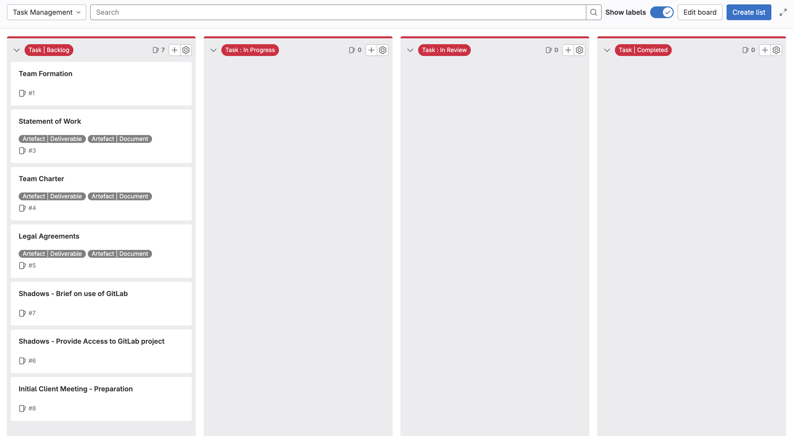
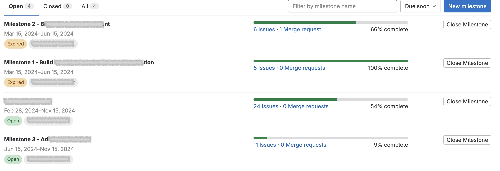
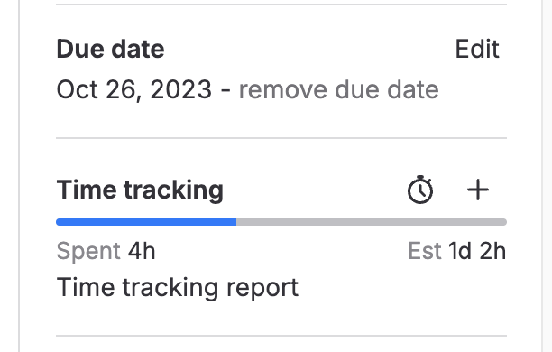

# GitLab concept - Issues

[GitLab Issues](https://docs.gitlab.com/ee/user/project/issues/) are probably the most important concept in GitLab.

You can use *GitLab Issues* to represent and manage many aspects of your project, including:

* Planning, estimation and progress tracking
* Requirements
* Tasks
* Documentation
* Decisions
* Risks
* Problems
* Feedback
* Reflections

This may be confusing to some because the word *'issue'* is often associated with a problem or bug. However, this is not the case in *GitLab*. As indicated above, *issues* can be used to represent many aspects of your project.

## Issue Activity Logs

Every GitLab issue has a section in which project members can make comments, add details, and engage in discussions. These comments can include rich text, images, and links to other items in the GitLab project (including other issues, code and documentation).

We refer to these records as the issue **'*Activity Log*'**. These logs record the time that each entry is made and who made them.

*Activity Logs* are a great place to engage in discussions about requirements, decisions, code, research and much more. As we will see later, they are also a great place to record meeting agenda and minutes, as well as feedback and reflections.

By recording everything you do in issue *Activity Logs*, you can be sure that your client, shadows, tutor and examiners can review all of your work. 

## Why use GitLab Issues?

GitLab issues can be used to:

* **Capture, manage and report all project information.** Issues can be used to represent all aspects of your project including requirements, constraints, tasks, decisions, risks, problems and feedback. Descriptions of these things can include rich text, images and videos.

* **Record and report all work done on the project.** Tasks (represented as GitLab issues) can be used to record all work done on a project. They can also capture estimates and records of time spent by team members.

* **Plan, organise, and visualise a workflow.** GitLab [boards](./concept-boards.md) allow users to move issues through stages of a defined work flow.

	In the following example, *Tasks* can be move through the workflow from *'Backlog'* to *'In Progress'* and subsequent stages until *'Completed'*)

	
 
* **Manage and report project progress.** Estimated completion dates can be added to tasks. [Milestones](./concept-milestones.md) can then be defined as a set of tasks that need to be completed by a specific date. GitLab can then present reports and charts that show project progress in terms of tasks completed towards each milestone.

	

	It is possible to enter estimates of time required to complete each task. Team members can also enter records of times spent on each task. GitLab can use this information to report progress on each task.

	{width=25%}

* **Predict project progress.** By entering estimates and records of time spent on each task, it is possible to predict when tasks and milestones are likely to be complete (as opposed to what was planned).

* **Record, manage and demonstrate effective stakeholder engagement.** If stakeholders have access to your project, they can engage in *Activity Log* discussions along with team members. If they cannot access your GitLab, records of conversations can be maintained by team members.
	
	If all stakeholder communication is captured in issue *Activity Logs*, it will be possible to use GitLab reports to demonstrate stakeholder engagement.

* **Link related information within an integrated repository.** Any text in an issue (eg. description and *'Activity Log'* posts) can include clickable links to other issues, code and documents within the GitLab project. Effective use of these features can significantly improve the ability of project members, including examiners, to find the information they need.
