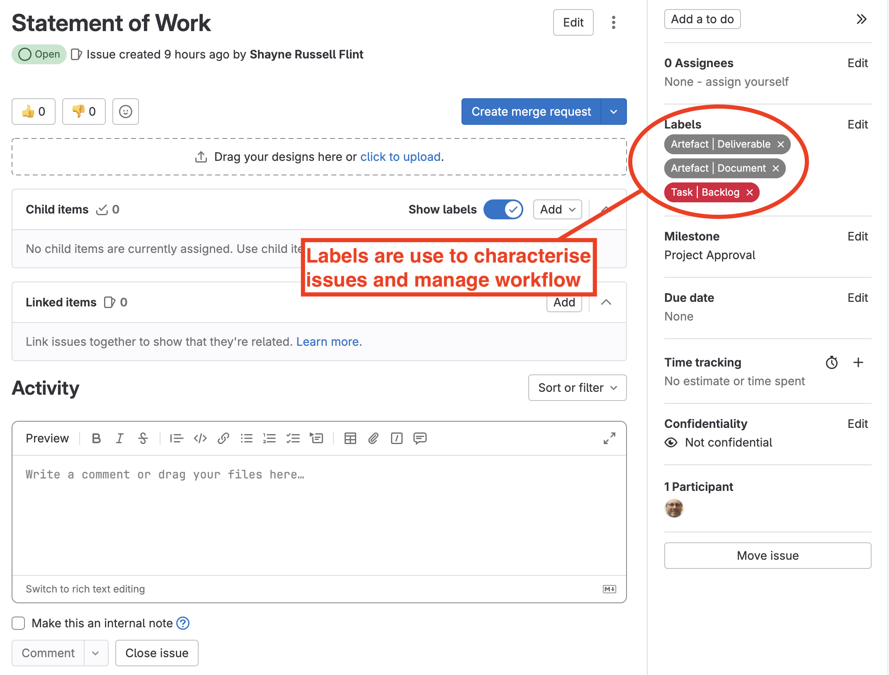

# GitLab concept - Labels

[Gitlab Labels](https://docs.gitlab.com/ee/user/project/labels.html) are a key concept in GitLab. They are created at the project level with a *'name'* and *'colour'*. They can then be used to *'tag'* issues.

For example, a label called *'Task'* could be used to tag issues that represent tasks to be completed by team members. Similarly, a label called *"Decision"* could be used to tag an issue used to keep a record of a decision made by the team.

## Grouping Labels

It is suggested that *labels* themselves be grouped. For example, the following labels might be used to tag tasks at various stages in a workflow:

* Task | Backlog
* Task | In Progress
* Task | Under Review
* Task | Completed

Labels could also be grouped to indicate sub-categories such as:

* Feedback | From Shadows
* Feedback | To Shadows
* Feedback | From Tutor
* Feedback | From Client
* Feedback | From Examiners
* Feedback | From Clinic

## Labels and Work Flows

We will discuss labels to define work flows in the section on [issue boards](./concept-boards.md).

{width=75%}
