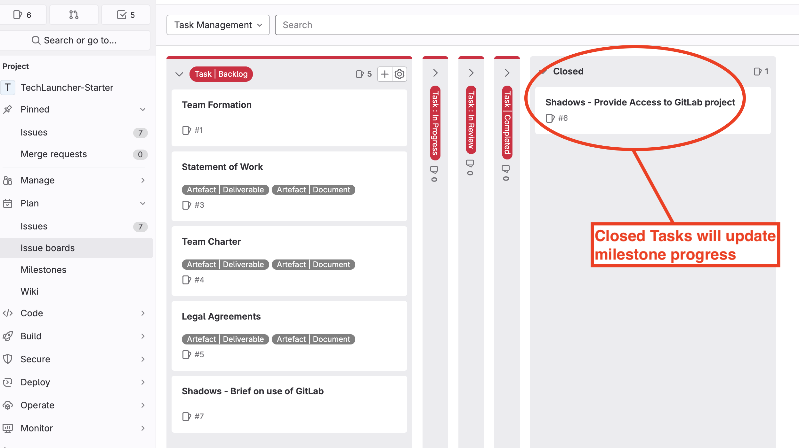

# Task Management

The *Task Management* board is the most important board for managing the flow of work during your project. It shows the status of all tasks, thus indicating project progress.

The *Task Management* board can be defined using the following labels:

* **Task | Backlog**

	These are tasks that need to be completed, but they have not yet been assigned to team member. They may not have any estimates and may not be completely defined. 
	
	Tasks should be created for **ALL** work done on a project, including meetings, documentation, presentations, design, coding, testing etc. - **everything**. This will ensure that examiners and tutors have a complete picture of all work done by the team and individual team members.

* **Task | In Progress**

	These are tasks that have been assigned to one or more team members and are being actively worked on. As such, this board column shows **ALL** of the work currently being done by the team.
	
* **Task | In Review**

	Many tasks will need to be reviewed by the team and/or client before they can be moved to the *Task | Completed* state.
	
	Note that, if a review fails, the task may be returned to the *Task | Underway* state for rework, or to the *Task | Backlog* state if it needs more significant attention.
	
* **Task | Completed**

	When a Task has passed review, it will be moved to the *Task | Completed* column.

## Task Management and Milestones

All Tasks will be assigned to a project [milestone](./concept-milestone.md). These milestones track progress by reporting the percentage of *Closed* tasks at a given point in time.

When you create an Issue Board, GitLab will include two *special* columns by default:

* **Open.** This column will list all *Open* issues.
* **Closed.** This column will list all *Closed* Issues

Normally, you would disable these columns. However, because *Milestones* monitor the *Open/Closed* state, the *Closed* Column should be enabled on the *Task Management* board. This will allow you to move *Tasks* to the *Closed* column when you are ready for them to be included in the Milestone progress reports.

