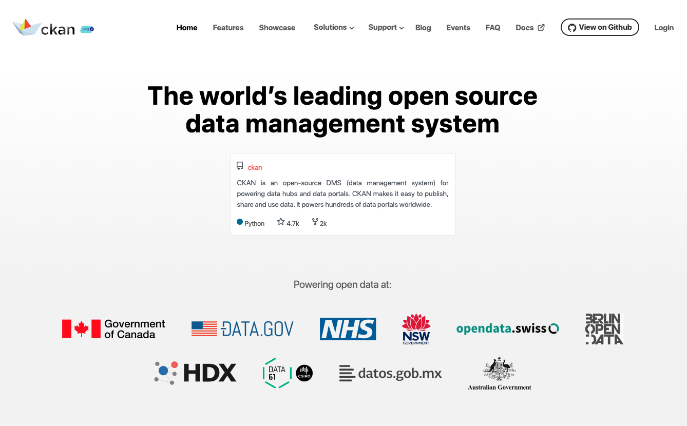

# CKAN Project Analysis and Dashboard -- Link Digital

Before reading this file, you may want to plumb on these relative websites.
- [CKAN Website](https://www.ckan.org/)
- [CKAN GitHub Page](https://github.com/ckan/ckan)
- [Link Digital Website](https://linkdigital.com.au/)

---

This project showcases the outcomes of my internship at **Link Digital**, focusing on two core components:

1. **Data Analysis and Visualization** of the Canberra rental market.
2. **Interactive Dashboard Development** for real-time trend presentation using CKAN datasets.

---

## 📊 Part 1: Data Analysis

Using Python and the CKAN API, I collected and analyzed rental housing data in the Canberra area. The pipeline includes:

- **Web Scraping**: Automated data collection from real estate websites.
- **CKAN API Integration**: Accessing open government data via CKAN endpoints.
- **Data Cleaning**: Handling missing values, formatting inconsistencies, and deduplication using `pandas`.
- **Statistical Analysis**: Exploratory data analysis to identify trends and patterns.
- **Data Visualization**: Created charts and plots using `matplotlib` and `seaborn`.

### 🔧 Tools & Libraries:
- Python, Requests, BeautifulSoup
- Pandas, NumPy, Matplotlib, Seaborn
- CKAN API

### 🧮 Steps & Highlights:

- **Data Collection**: Scraped over 500 ACT rental listings using Python and the CKAN API, focusing on price, location, bedroom count, and proximity to schools.
- **Data Cleaning**: Performed null-value handling, duplicate removal, type casting, outlier detection, and standardization for modeling readiness.
- **Exploratory Analysis**:
  - Conducted descriptive statistics and correlation heatmaps to identify key trends.
  - Found strong positive correlations between rental price and the number of bedrooms, bathrooms, and parking spots.
- **Predictive Modeling**:
  - Built **Decision Tree** and **Random Forest** models.
  - Achieved **R² = 72.65%** using Random Forest.
  - Most impactful features: `bedrooms`, `parking`, `bathrooms`, and school proximity.
- **Market Insights**:
  - Segmented ACT rental market into low/mid/high tiers.
  - Suburbs like **Campbell** and **Yarralumla** consistently ranked highest in rental cost.
- **Reporting**: Generated a professional visual report in PDF summarizing the entire analysis.

### 📁 Refer to the following folders:
- `Data Collection Result/`
- `Data Cleaning/`
- `Data Analysis/`
- `CKAN Learning Outcome Files/`

---

## 💻 Part 2: Web Dashboard (Frontend Development)

To present the insights visually, I developed an **interactive dashboard** using Vue.js that dynamically renders CKAN-hosted rental datasets.

### ✨ Key Features:
- **Live data integration** with CKAN API.
- **Geographic comparison** between suburbs using charts.
- **Component-based modular design** using Vue 3.
- **Interactive UI** to toggle between variables such as rental price, bedrooms, and parking availability.

### 🔐 Note on Source Code Availability:
Due to **intellectual property restrictions** enforced by the hosting company, the full frontend source code cannot be made publicly available.

> However, a **basic public demo version** has been reconstructed based on the original structure, and representative **screenshots** of the actual system are provided below to demonstrate the core functionality.

### 📷 UI Snapshots

| Home  Page | Datasets Page | Organizations Page | About |
|-------------------|------------------------|----------------------| ----------------------|
|  |  |  |  

### 📁 Refer to the following folder:
- `Website/`

---

